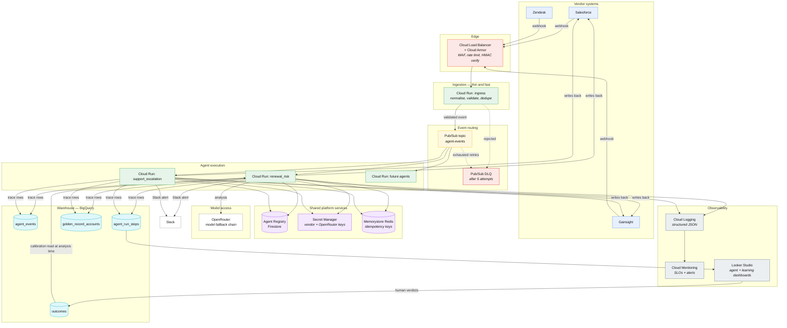
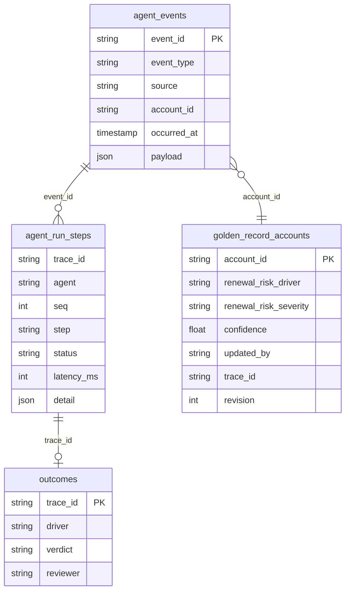

# Cloud Architecture

GCP, because the Golden Record already lives in BigQuery. Keeping the agent platform in the same project means the warehouse is a native sink rather than an export job, and IAM is one story instead of two.

The local build maps 1:1 onto this. Nothing here is a redesign — `store.py` already defines the warehouse interface, and ingestion is already a single function (`Platform.ingest`) that a worker can call.

## Target architecture

## Why each choice

| Service | Why this, not the alternative |
|---|---|
| **Cloud Run** | Request-driven and scales to zero. Agent load is spiky (health scores recalc nightly, then nothing). GKE would mean paying for idle capacity and running a cluster nobody on a small platform team wants to own. |
| **Pub/Sub** | The decoupling the JD describes. Publishers never learn who subscribes; onboarding an agent is a subscription plus a registry entry. Gives retries, ordering keys per account, and a native DLQ. |
| **Cloud Run ingress split from workers** | Vendors time out webhooks in seconds; LLM analysis takes tens of seconds. Separating them means a slow model can never cause a vendor to mark our endpoint unhealthy and start dropping events. |
| **BigQuery** | Already the Golden Record home. Traces land where analysts can join agent behaviour to revenue data — "did accounts we alerted on actually renew?" becomes SQL, not an integration project. |
| **Firestore for the registry** | Low-latency point reads on every event, and the registry is read constantly, written rarely. BigQuery is the wrong shape for that. |
| **Memorystore for idempotency** | Dedupe must be fast and atomic. A BigQuery lookup per event is neither. |
| **Secret Manager** | Vendor keys and the OpenRouter key rotate independently of deploys, with IAM audit trails. |
| **Looker Studio** | Non-engineers need the dashboard. Keeping it in GCP means no extra auth surface and no data leaving the project. |

## BigQuery layout

- `agent_events`, `agent_run_steps`, `outcomes`: **append-only**, streaming inserts, partitioned by ingestion date, clustered on `(agent, account_id)`. Append-only means the audit trail cannot be quietly rewritten.
- `golden_record_accounts`: `MERGE` on `account_id`, updating only the columns this platform has authority over. Every row carries `updated_by` and `trace_id`, so any value traces back to the run that produced it.
- Partition expiry on the trace tables (12 months) keeps cost bounded.

## Operating it

**Scaling.** Cloud Run min-instances 0 for workers, 1 for ingress (avoid cold-start on vendor webhooks). Pub/Sub ordering key = `account_id`, so two events for the same account can't race each other into the Golden Record. Concurrency capped per worker so a burst can't blow the OpenRouter rate limit.

**Cost.** Token spend is logged per run, so cost is queryable per agent, per driver, per account. A daily budget in config, plus a Cloud Billing alert. Severity band picks the model: low-severity accounts get the cheap model, exec-escalation accounts get the strong one.

**Security.** HMAC signature verification at Cloud Armor. Per-agent service accounts, so an agent's IAM grants match its registry `tools:` list — least privilege enforced twice. No secrets in traces (`_redact` in `clients/base.py`). Slack messages carry a trace link, never raw customer PII beyond what the alert needs.

**SLOs and alerts.** Ingest→alert p95 latency; grounding-verification failure rate; DLQ depth > 0; agents overdue for review; daily LLM spend vs budget; deterministic-fallback rate (a spike means the model or a vendor is degraded).

**CI/CD.** Cloud Build on merge: tests → golden eval → deploy to staging → smoke → canary 10% via Cloud Run traffic splitting → full. Prompt changes go through the same gate as code, because they are code.
